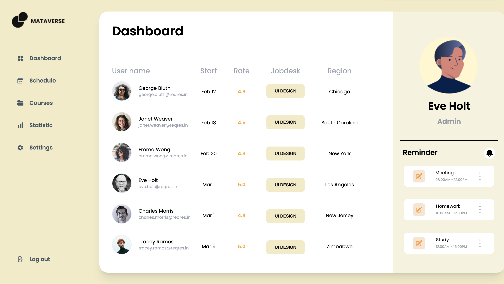

# Simple Dashboard using ReactJS 

 
This project features a straightforward dashboard built with ReactJS, incorporating Material-Tailwind for UI components and Animate.css for animations.

## Introduction

This Dashboard provides a minimalistic yet functional interface developed using ReactJS. Material-Tailwind is utilized for its pre-designed UI components, ensuring consistency and ease of use. Additionally, Animate.css adds subtle animations, enhancing the overall user experience.

## Features

- **Responsive Design:** Ensures optimal display across various devices.
- **Material-Tailwind Integration:** Offers customizable and ready-to-use UI components.
- **Animate.css Effects:** Adds smooth and visually appealing animations.
- **Ease of Customization:** Simple structure allows for easy modifications.

## Usage

This dashboard project can be easily integrated into your ReactJS application. Incorporate the components and styles provided based on your requirements.

Feel free to modify and extend this dashboard according to your specific needs.
